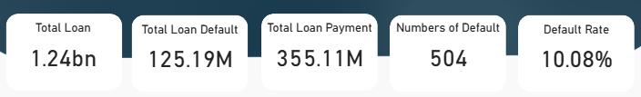
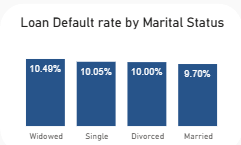
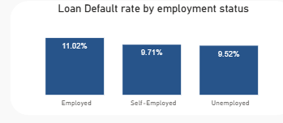
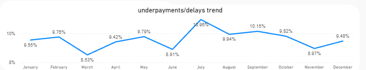
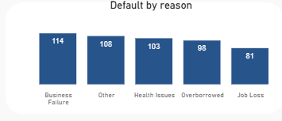

#  Who's Defaulting?  
### A Deep Dive into Loan Defaults and What Drives Them

## Project Overview
Understanding why and who defaults on loans is crucial for financial institutions aiming to minimize risk and maximize repayment. This project explores customer behavior, regional risk distribution, and systemic factors contributing to loan defaults using synthetic loan performance data visualized in Power BI.

##  The Problem

Loan defaulting costs businesses billions every year. But behind every default is a pattern — a story that, if understood, can help lenders act earlier and smarter.  

So, I set out to answer:
- Who are the people most likely to default on loans?
- When do they tend to default?
- What’s causing these defaults?

Using a simulated dataset and Power BI, I built a dashboard to unpack the hidden drivers behind loan defaults and give stakeholders tools to reduce risk.

---

##  Objectives

- Analyze borrower demographics and behaviors contributing to loan defaults  
- Identify the riskiest loan types, regions, and age groups  
- Understand default timing and frequency  
- Reveal key reasons behind customer default behavior

---

##  What I Found

Here’s a quick snapshot of the reality:

-  **Default Rate** stands at **10.08%**, representing over **₦125 million** in unpaid loans.
  

-  **Ages 45–54** carry the highest default rate at **11.17%** — mid-life financial pressure?
  

-  **Auto loans** top the risk chart (10.17%), followed closely by **business and Education loans**.
           

-  **Widowed individuals** have the highest default rate by marital status.
  
  

-  Surprisingly, **employed individuals** default more often (11.02%) than the unemployed (9.52%) — maybe due to overcommitment?
  
   

-  Defaults spike in **April and October**, hinting at financial cycles or external stressors.

   

-  The **top 3 reasons** for default:  
  - Business failure  
  - Health issues
  - Borrowing beyond means

                

##  So What Can Be Done?

Based on this analysis:
-  Focus risk assessment on **mid-age borrowers** with high-value home or business loans
-  Provide **financial literacy programs** to employed customers taking on large credit
-  Improve early alert systems around **April and October** default spikes
-  **Revise loan conditions** for high-risk age groups and home/business loan types
-  **Strengthen borrower vetting** for mid-income and employed applicants 

 ---

 
##  Dashboard Preview

 [View the full dashboard in PDF](./Loan%20Default%20dashboard.pdf)  
 Explore the interactive and dynamic dashboard in [Power BI here](https://app.powerbi.com/view?r=eyJrIjoiMmM2NTE1YjYtNjdlMC00NDQxLWIzMzUtOTJmZDQ3MGZhNmI4IiwidCI6IjJjZDk3YzU4LTY0ODAtNDEzYS1hNjMyLWI1OTNiMDZkZjgyOCJ9).
 

---
## 👋 Meet the Analyst

Hi! I’m **Ufuoma Ogeh**, and I love uncovering insights that help people make better decisions. With a background in supply chain inventory management and a passion for data storytelling, I use tools like excel, Power BI and SQL to bring numbers to life.  

📬 Let’s connect:  
[LinkedIn](https://www.linkedin.com/in/uogeh/) | [Email](ufuomaogeh@yahoo.com) | [Portfolio](https://uogeh.github.io/Ufuomaportfolio/) | [Medium post](https://medium.com/@ogehufuoma)
